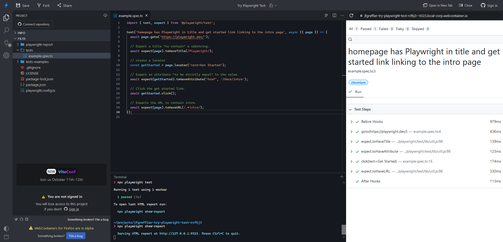

# Try Playwright Test

[](https://playwright.dev/) [](https://stackblitz.com/fork/github/jfgreffier/try-playwright-test?title=Try%20Playwright%20Test)

Try Playwright Test lets you execute tests in your browser on StackBlitz

## Usage

[Open in StackBlitz](https://stackblitz.com/fork/github/jfgreffier/try-playwright-test?title=Try%20Playwright%20Test)

You will have the StackBlitz online IDE


To run tests, simply use
```
npm test
```

HTML report can be displayed with
```
npx playwright show-report
```
